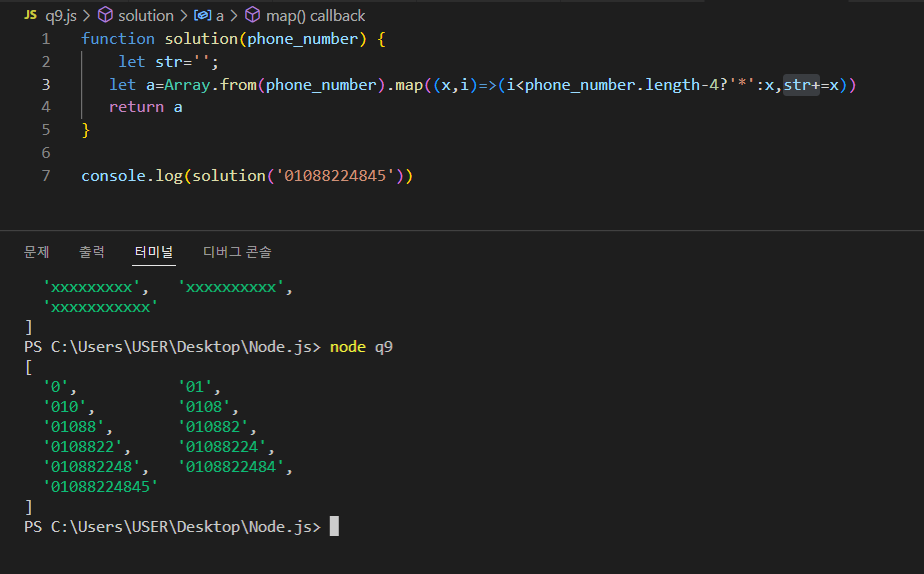
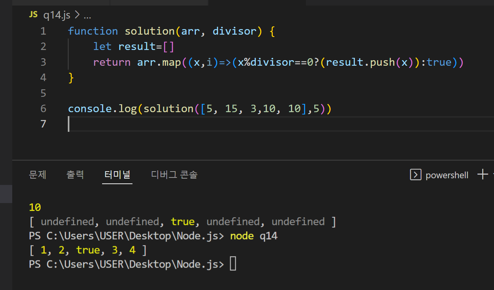

# 1일차
항해에서부터 시작하는 블로그
(한번 날라감)

# 활동 

프로그래머스에서 문제풀기 언어는 jS
 
# 프로그래머스 
<a href='https://school.programmers.co.kr/'>이동</a>

# JS

+ ### Study
  + substr 변수가 실수형이여도 정수형이 되는 형상
  + + -,+ 또한 문자가 아니라 숫자형으로 된다.
  + include:포함되어있는지 확인하는 메소드
  + callback function 파라미터로 함수를 전달
  + 콜백함수는 이름이 없기때문에 화살표로 하여 표현되기도 하며 일반적인 함수처럼 function을 사용하여 표현되기도 한다.
    +이름만을 넘겨서 사용하여 변수처럼 활용되기도 한다.
  + reduce,map :arrays의 메소드
    
    + 맵은 배열에서 하나의 원소마다 함수를 적용시킨다
    
    + map 안에서는 자신을 지칭하는 변수가 아니여도 자신을 가르킨다.
    
  +	함수선언식,함수표현식

#키워드

> String
> 
> ` 
> 문자열의 생성자이며 특징으로는 주어질때 배열과 같은 형태를 하고 들어온다.
> `
> > 문자열 분활/부분-삭제
> > > substr
> > > This is a normal paragraph:
> > >    This is a code block.
> > > end code block.
> > > `
> > > This is a normal paragraph:

    This is a code block.
    
end code block.
> > > `

# 신기한거  

{: width="300" height="300")

` 이 map은 안에 자기 원소를 가르키는 변수도 없는데 연관되어있는거 없는거 다 자기로 바꿔서 자기 먹고 저런결과 나오드라?`

 {: width="300" height="300")

 ` 이게 신기한게 뭐냐면 안에 변수도 값도 없는데 1,2,3,4가 나와있음 ` 
 
