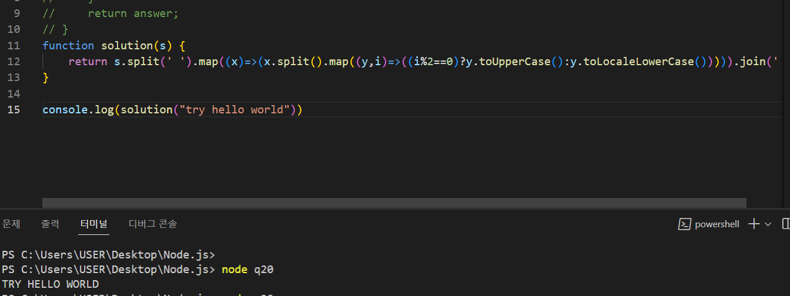

# 2일차(같은 3일차)
항해에서부터 시작하는 블로그

# 활동 

프로그래머스에서 문제풀기 언어는 jS (2일차)
 
# 프로그래머스 
<a href='https://school.programmers.co.kr/'>이동</a>

# 운동
+ 없다.
  + 숨쉬기
+ 내일 계획
  + 과거 집가서 청소 및 배송

# JS

+ ### Study
  + gitignore
  + {} js에서 패스
  + === :명확한 비교
    + 보통의 ==비교연산자는  '1'==1이면 같은데 === 의 경우 타입까지 같다.
  + slice(음수)
    + 뒤에서 음수만큼 놔두고 자른다.
  + 배열로 객체 키값만들기
  + 유니코드
    + // a:97~z:122
    + // A:65~Z:90

# 키워드

> Array
> 
> ` 
> 리스트와 비슷한 객체로서 순회와 변형 작업을 수행하는 메서드를 갖습니다. 
> JavaScript 배열은 길이도, 각 요소의 자료형도 고정되어 있지 않습니다.  
> 배열의 길이가 언제든지 늘어나거나 줄어들 수 있고 데이터를 연속적이지 않은 곳에 저장할 수 있으므로,  
> JavaScript 배열은 밀집성을 보장하지 않습니다
> `
> > ### Remeber
> > 배열을 index를 기준으로 변수를 담는 통들의 위치라고 기억하고 있는데
> > 여기서 `JS`에서 착각하면 안되는것은 index가 숫자라고 하지 않았다.

# 신기한거  

` 뒤편에 map에서 i가 0에서 고정되서는 저렇게 모든 문자열이 바뀌는 현상이 이러남?`

var solution=(_,$)=>_.find(_=>!$[_]--,$.map(_=>$[_]=($[_]|0)+1))
` 20번 문제인데 이미 있는 배열로 객체로 대신 사용하여 키값을 생성 그후  find와 객체를 이용해서 찾는다. `
