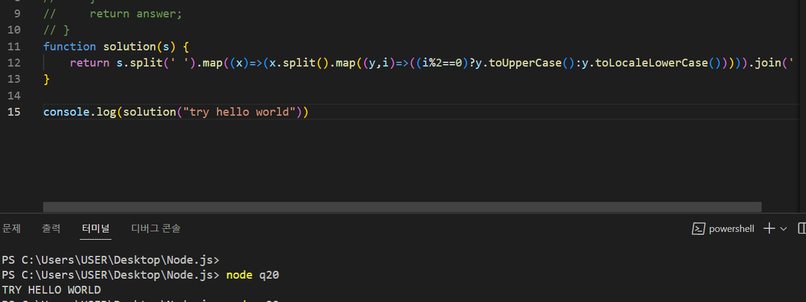

# 4일차
항해에서부터 시작하는 블로그

# 활동 

이사 정리, 프로그래머스 문제
 
# 프로그래머스 
<a href='https://school.programmers.co.kr/'>이동</a>

# 운동
+ 비 엄청 내려서 못감
+ 내일 계획
  + 아침에 런닝
  + 비오면 간단 맨몸 운동 

# JS
+ 
그저 오타였다 딱히 index문제는 아니였던걸로

+  this
    + 공부

+ JS의 자료형과 형변환에 대해서
    + 과제로 한번 작성은 했지만 다시 언급한다. 
    + JS의 자료형은 느슨한 자료형을 가지며 이를 동적언어라고 한다. 또한 형변환이 자유로워 2가지로 나누는데 이를 명시적과 암시적 형변환으로 나눈다.
    + JS는 이 때문에 타입까지 맞아야하는 비교연산자인 ===가 있는데 이것은 타입까지 맞아야 나갈수있다.
    + null , undefined의 경우에는 자료형이라는 것은 처음 알았으며 이를 통해 여러가지 오류가 이해하였다.

+ 연산자 
  + \*\*의 경우에는 앞을 기준으로 뒤 숫자로 제곱한다는 것인데 예를들면 3\*\* 3이면 이것은 3^3이므로 27이 된다.

+ 함수표현식 이해
  + //안에서 이루어지며 ^가 달리면 부정, []은 안의 단어들, \\정확하게, 등 여러가지있는데 아직 다 모르기때문에 추가적인 공부가 필요하다.

 